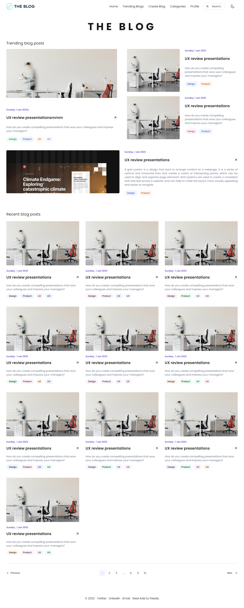
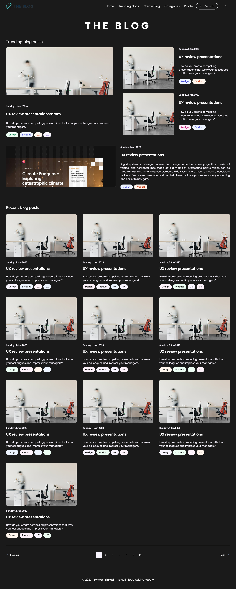

# React Blog Template

## Description
React Blog Template is a boilerplate project for creating blogging websites' UI using React.js. It provides a clean and responsive design powered by Tailwind CSS and includes integration with React Icons for easy icon usage.

## Features
- Responsive design powered by Tailwind CSS.
- Integration with React Icons for easy icon usage.
- Clean and customizable UI components for creating blogging websites.
- Easy-to-understand code structure for seamless integration into your main full-stack projects.

## Technologies Used
- React.js
- Tailwind CSS
- React Icons

## Installation
1. Clone this repository to your local machine:
2. Navigate to the project directory:
3. Install dependencies:
4. Start the development server:

5. Open your web browser and visit `http://localhost:3000` to view the template.

## Contributing
Contributions are welcome! Feel free to submit pull requests to suggest improvements, fix bugs, or add new features.

## feel free to use the template as you wish.

## Acknowledgements
- Tailwind CSS: [https://tailwindcss.com/](https://tailwindcss.com/)
- React Icons: [https://react-icons.github.io/react-icons/](https://react-icons.github.io/react-icons/)

## The Figma design are created by [Faqih Sopyan](https://www.figma.com/community/file/1235152009438565697/the-blog-a-web-personal-blog)

## Preview Images

## Contact
For any questions or inquiries, please contact [inbox.nuralam@gmail.com](mailto:inbox.nuralam@gmail.com).

